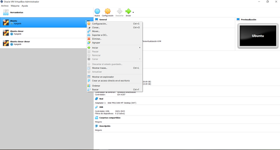

# Práctica 3: Compilación del kernel de Linux

##  ¿Cómo hacer un respaldo de una máquina virtual? y ¿cómo levantar ese respaldo?

##  Explicar la nomenclatura del kernel

##  Investigar y enlistar los paquetes requeridos para la compilación y ¿cómo instalarlos desde terminal?

##  ¿Cómo descargar una versión de kernel desde terminal?

##  ¿Cómo extraer el código comprimido del kernel desde terminal?

##  ¿Cómo configurar el kernel?

##  ¿Cómo compilar el código del kernel?

##  ¿Cómo instalar módulos?

##  ¿Cómo indicarle a la computadora con cuál kernel debe iniciar?

##  ¿Cómo verificar el cambio de kernel a partir de consola?
