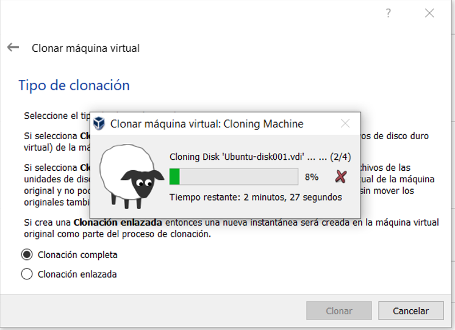

# Práctica 3: Compilación del kernel de Linux

##  ¿Cómo hacer un respaldo de una máquina virtual? y ¿cómo levantar ese respaldo?
Cuando se realizan procedimientos que involucran al kernel, es importante realizar una copia de seguridad para prevenir que se pierdan los datos en caso de que exista algún fallo, está práctica fue realizada en un clon de la máquina virtual. Para hacer el respaldo se selecciona la máquina y se selecciona la opción de clonar, como se puede observar en la siguiente figura:


Nos aparece la siguiente ventana, en donde se debe seleccionar un nombre para la máquina virtual, la ruta para guardarla y marcar las opciones adicionales. 


Seleccionamos la opción de clonación completa e inciamos la clonación de la máquina virtual. 


Una vez finalizado el proceso se puede observar en la parte izquierda, la copia de la máquina virtual.


En la parte superior izquierda se puede observar como la máquina que esta corriendo en la clonada.


##  Explicar la nomenclatura del kernel

##  Investigar y enlistar los paquetes requeridos para la compilación y ¿cómo instalarlos desde terminal?

Antes de poder realizar la compilación del kernel es necesario instalar los siguientes paquetes:

* git
* fakeroot
* build-essential
* ncurses-dev
* xz-utils
* libssl-dev
* bc
* flex
* libelf-dev
* bison

Para poder realizar la instalación desde terminal se utiliza el siguiente comando:
```bash
sudo apt-get install git fakeroot build-essential ncurses-dev xz-utils libssl-dev bc flex libelf-dev bison
```


Además se requiere de la instalación de los siguientes modúlos adicionales:
* dwarves
* zstd
Para poder realizar la instalación desde terminal se utilizan los siguientes comandos:
```bash
sudo apt install dwarves
```
```bash
sudo apt-get install zstd
```


Es importante mencionar que para la instalación y pasos posteriores se debe contar con todos los permisos. 

##  ¿Cómo descargar una versión de kernel desde terminal?

Para descargar una versión de kernel se utiliza el comando wget junto con el link de la versión que se requiere, en este caso se seleccionó la versión  5.17.5. Para esto, se visita el sitio oficial de Linux con las diversas versiones de kernel : https://www.kernel.org/

```bash
wget https://cdn.kernel.org/pub/linux/kernel/v5.x/linux-5.17.5.tar.xz
```

##  ¿Cómo extraer el código comprimido del kernel desde terminal?

##  ¿Cómo configurar el kernel?

##  ¿Cómo compilar el código del kernel?

##  ¿Cómo instalar módulos?

##  ¿Cómo indicarle a la computadora con cuál kernel debe iniciar?

##  ¿Cómo verificar el cambio de kernel a partir de consola?





