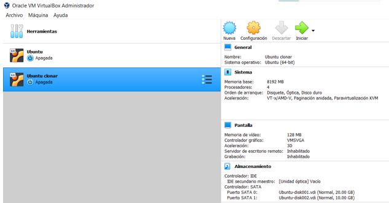
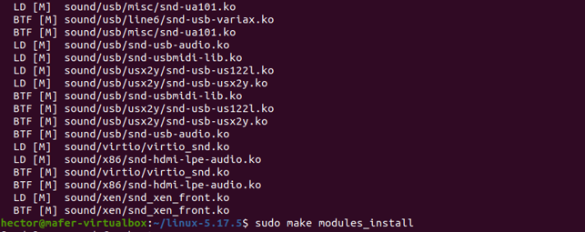
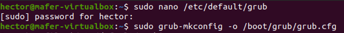
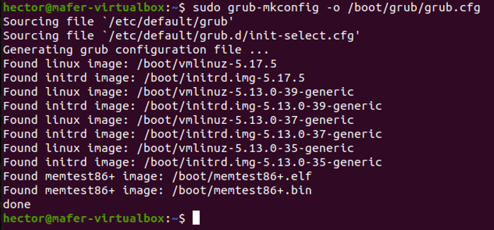

# Práctica 3: Compilación del kernel de Linux

##  ¿Cómo hacer un respaldo de una máquina virtual? y ¿cómo levantar ese respaldo?
Cuando se realizan procedimientos que involucran al kernel, es importante realizar una copia de seguridad para prevenir que se pierdan los datos en caso de que exista algún fallo, está práctica fue realizada en un clon de la máquina virtual. Para hacer el respaldo se selecciona la máquina y se selecciona la opción de clonar, como se puede observar en la siguiente figura:


Nos aparece la siguiente ventana, en donde se debe seleccionar un nombre para la máquina virtual, la ruta para guardarla y marcar las opciones adicionales. 


Seleccionamos la opción de clonación completa e iniciamos la clonación de la máquina virtual. 


Una vez finalizado el proceso se puede observar en la parte izquierda, la copia de la máquina virtual.


En la parte superior izquierda se puede observar como la máquina que esta corriendo es la clonada.


##  Explicar la nomenclatura del kernel

La nomenclatura actual del kernel es la siguiente:

major#.minor#[.patchlevel][-EXTRAVERSION]

también se puede representar de la siguiente forma:

w.x[.y][-z]

En donde lo que está encerrado entre corchetes es opcional. 

* major#(w): número principal o mayor, es en donde más cambios y actualizaciones existen
* minor#(x): número menor, por debajo del número mayor de manera jerárquica, se realizn cambios significativos dentro de la misma versión principal 
* patchlevel(y): se le conoce como ABI, se aplica en versiones estables del kernel, se utiliza cuando se necesitan arreglar problemas de seguridad y de bugs
* -EXTRAVERSION(z): es utilizado por los distribuidores de kernels para poder rastrear los cambios internos 

Para está práctica se utilizó la versión 5.17.5, en donde el número mayor es 5, el número menor 17 y el patchlevel 5.

##  Investigar y enlistar los paquetes requeridos para la compilación y ¿cómo instalarlos desde terminal?

Antes de poder realizar la compilación del kernel es necesario instalar los siguientes paquetes:

* git
* fakeroot
* build-essential
* ncurses-dev
* xz-utils
* libssl-dev
* bc
* flex
* libelf-dev
* bison

Para poder realizar la instalación desde terminal se utiliza el siguiente comando:
```bash
sudo apt-get install git fakeroot build-essential ncurses-dev xz-utils libssl-dev bc flex libelf-dev bison
```


Además, se requiere de la instalación de los siguientes modúlos adicionales:
* dwarves
* zstd

Para poder realizar la instalación desde terminal se utilizan los siguientes comandos:
```bash
sudo apt install dwarves
```
```bash
sudo apt-get install zstd
```


Es importante mencionar que para la instalación y pasos posteriores se debe contar con todos los permisos. 

##  ¿Cómo descargar una versión de kernel desde terminal?

Para descargar una versión de kernel se utiliza el comando wget junto con el link de la versión que se requiere, en este caso se seleccionó la versión  5.17.5. Para esto, se visita el sitio oficial de Linux con las diversas versiones de kernel : https://www.kernel.org/

```bash
wget https://cdn.kernel.org/pub/linux/kernel/v5.x/linux-5.17.5.tar.xz
```


##  ¿Cómo extraer el código comprimido del kernel desde terminal?
Una vez que se descarga la versión del kernel, es necesario extraer el código ya que se encuentra compromido, para esto se debe hacer uso del siguiente comando, en donde se coloca el archivo que fue previamente descargado. 
```bash
tar xvf linux-5.17.5.tar.xz
```


##  ¿Cómo configurar el kernel?
Primero, es necesario movernos a la carpeta del kernel, después se realiza una copia del archivo de configuración del kernel actual a el archivo de configuración del kernel que queremos instalar.
```bash
cd linux-5.17.5
cp -v /boot/config-$(uname -r) .config
make menuconfig
```


Para poder cambiar la configuración, es necesario utilizar el siguiente comando, el cual despliega una interfaz gráfica para hacer las modificaciones correspondientes. Una vez que se termine, se guarda y se sale del menú, regresando así, a la línea de comandos. 


En la siguiente figura se muestra el menu correspondiente, en donde se tienen diversas opciones, al final es importante guardar los cambios correspondientes y salir. 


##  ¿Cómo compilar el código del kernel?
Antes de poder realizar la compilación del kernel, es necesario realizar unos pasos previos. En el archivo de configuración del kernel, es necesario modificar las siguientes líneas, a través de los siguientes comandos:

```bash
scripts/config --set-str SYSTEM_TRUSTED_KEYS
scripts/config --disable SYSTEM_REVOCATION_KEYS
```


Una vez realizado lo anterior se comienza con la compilación con el siguiente comando:
```bash
make
```




##  ¿Cómo instalar módulos?
El comando para instalar los módulos es el siguiente:
```bash
sudo make modules_install
```


##  ¿Cómo instalar el kernel?

Finalemente se realiza la instalación del kernel a través del siguiente comando:

```bash
sudo make install
```


##  ¿Cómo indicarle a la computadora con cuál kernel debe iniciar?
Al momento de iniciar la computadora es necesario presionar la tecla shift para poder ver el menú grub, el cual contiene las opciones de kernel que están disponibles, para poder visualizar ese menú se realizaron los siguientes pasos, se utilizó el siguiente comando para poder entrar al archivo de configuración de grub para poder insertar las siguientes tres líneas al inicio:
```bash
sudo nano /etc/default/grub
```


* GRUB_DISABLE_SUBMENU=y
* GRUB_DEFAULT=saved
* GRUB_SAVEDDEFAULT=true


Posteriormente para poder actualizar los cambios realizados se utiliza el siguiente comando:

```bash
sudo grub-mkconfig -o /boot/grub/grub.cfg
```


Finalmente al momento de reiniciar y presionar shift, aparece el menú como podemos observar en la siguiente figura, se selecciona el kernel con el cual se va a iniciar la máquina virtual. 


##  ¿Cómo verificar el cambio de kernel a partir de consola?

Para realizar la verificación de cambio de kernel se utiliza el siguiente comando, el cual nos indica la versión de kernel que se encuentra cargado actualmente:


Se puede observar en la figura que efectivamente, se realizó el cambio de manera existosa. 

## Referencias
https://phoenixnap.com/kb/build-linux-kernel
https://itsfoss.com/switch-kernels-arch-linux/
https://askubuntu.com/questions/1329538/compiling-the-kernel-5-11-11


